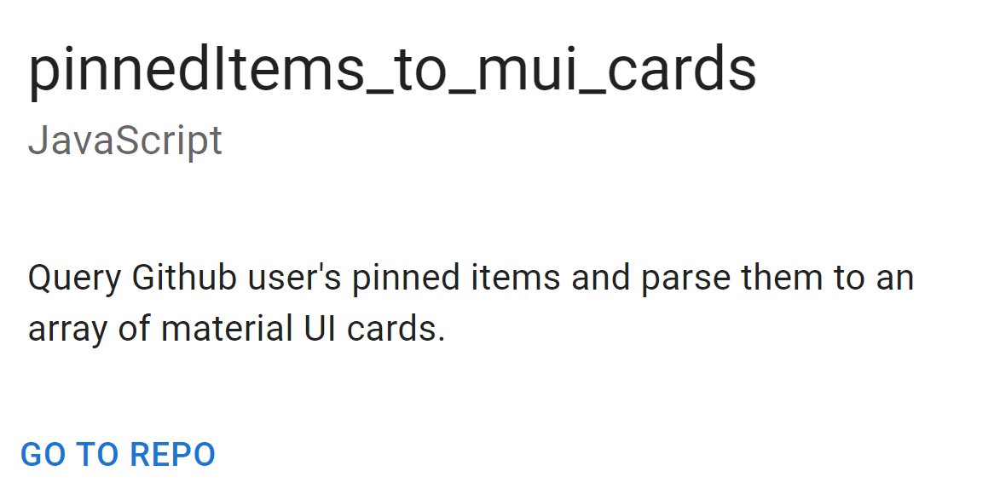

# Github pinned item to Material UI cards
## Usage:
Save `pinned-to-card.js` and `credentials.json` in `/src/` folder.
Add Github credentials and length of the item list in `credentials.json` file.
Sample call:
```{javascript}
import Pinned_to_card from "./pinned-to-card";
import {useAsync} from 'react-async';

function App() {
  const { data, error, isLoading } = useAsync({ promiseFn: Pinned_to_card,  });
  if (isLoading) return <div>Loading...</div>;
  if (error) return <div>Error!</div>;
  if (data) return <div>{data}</div>;
  return <div>Nothing</div>;
}export default App;
```
returns component: MUI cards.
## Dependencies:
`react-async`
`react-mui`
`graphql-request`
...see `package.json`.
## Sample Card:


